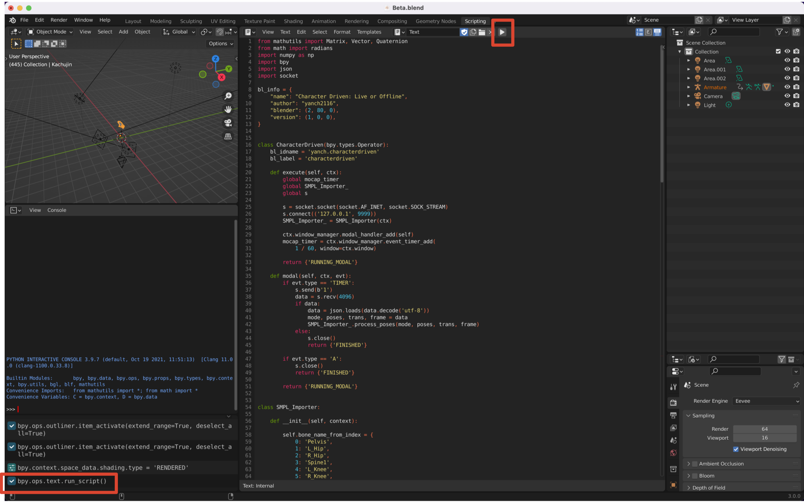

[English](README.md)｜[中](README.zh_CN.md)

# 驱动 3D 人物的 Blender 插件

该插件通过传输 SMPL 的姿态和全局位置到 3D 人物的骨架中来驱动 3D 卡通人物。姿态和全局位置可以通过 ROMP 或者任意基于 SMPL 的 3D 姿态估计模型从 RGB 图像中获得。如果估计模型能够以较高速度输出姿态和全局位置，那么就能够在 Blender 中实现实时驱动 3D 人物的效果。

## 两种流程

### 从视频到动画

步骤：

1. 修改[server.py](src/server.py)中的[results.npz](demo/results.npz)路径，并在命令行启动 server.py
2. 打开[Beta.blend](blender/Beta.blend)，并点击右上角三角，看到左下角提示，说明插件运行成功
   
3. 回到 layout 视图，点击右上角小图标获取 Texture
     
4. 按下 Ctrl+E 运行插件，此时在运行 server.py 的命令行中会提示当前正在传输的关键帧，传输结束后连接断开
   
5. 在 Blender 中按下空格键即可观看到人物动画

> 如果你想要使用自己的视频，你需要使用 [ROMP](<(https://github.com/Arthur151/ROMP)>) 的[video.sh](https://github.com/Arthur151/ROMP/blob/master/scripts/video.sh)获取 npz 文件。

### 摄像头实时驱动3D人物

步骤：

1. 连接摄像头，启动 ROMP 的 [webcam_blender.sh](https://github.com/Arthur151/ROMP/blob/master/scripts/webcam_blender.sh)
2. 其余步骤与`从视频到动画`的2、3相同，按下Ctrl+E后，Blender中的3D人物便会实时驱动；按下A键便能够停下来

## 使用你自己的3D人物

如果你对Blender很熟悉，你希望使用自己的3D人物，那么你需要确保它的骨架与SMPL骨架完全一致，并且各骨头的命名也与我的3D人物的骨头命名一致（当然，你也可以修改插件中的骨头命名）。只需要SMPL的24个骨头命名保持一致即可，不需要改变手指骨头的命名。

## 使用你自己的动画背景

当你渲染动画时，你可能希望有一个好看点的背景。我在Compositing中设置好了添加背景的方法，你只需要点击Open Clip，选中自己的视频即可。在实时驱动时最好不要添加视频，防止动画太卡。

  

## 致谢

- [Mixamo](https://www.mixamo.com/#/)：3D人物从该网站下载
- [Blender 2.8](https://www.bilibili.com/video/BV1T4411N7GE?spm_id_from=333.999.0.0)：第零、一、十三章的知识尤其有用
- [Blender Manual](https://docs.blender.org/manual/en/latest/)
- [Blender Python API](https://docs.blender.org/api/current/index.html)
- [neuron_mocap_live-blender](https://github.com/pnmocap/neuron_mocap_live-blender)
- [QuickMocap-BlenderAddon](https://github.com/vltmedia/QuickMocap-BlenderAddon)
- [remote-opencv-streaming-live-video](https://github.com/rena2damas/remote-opencv-streaming-live-video)
